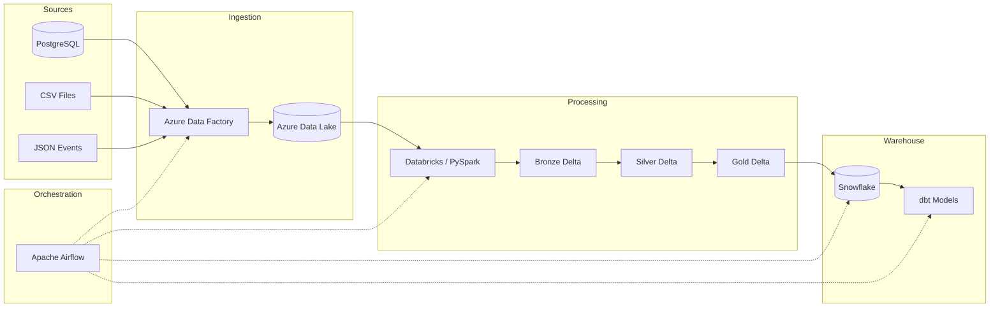
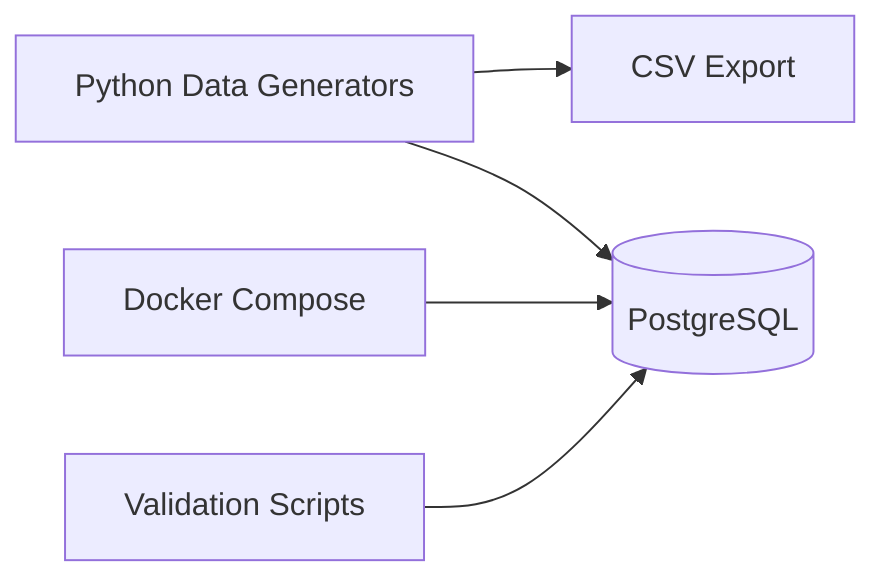
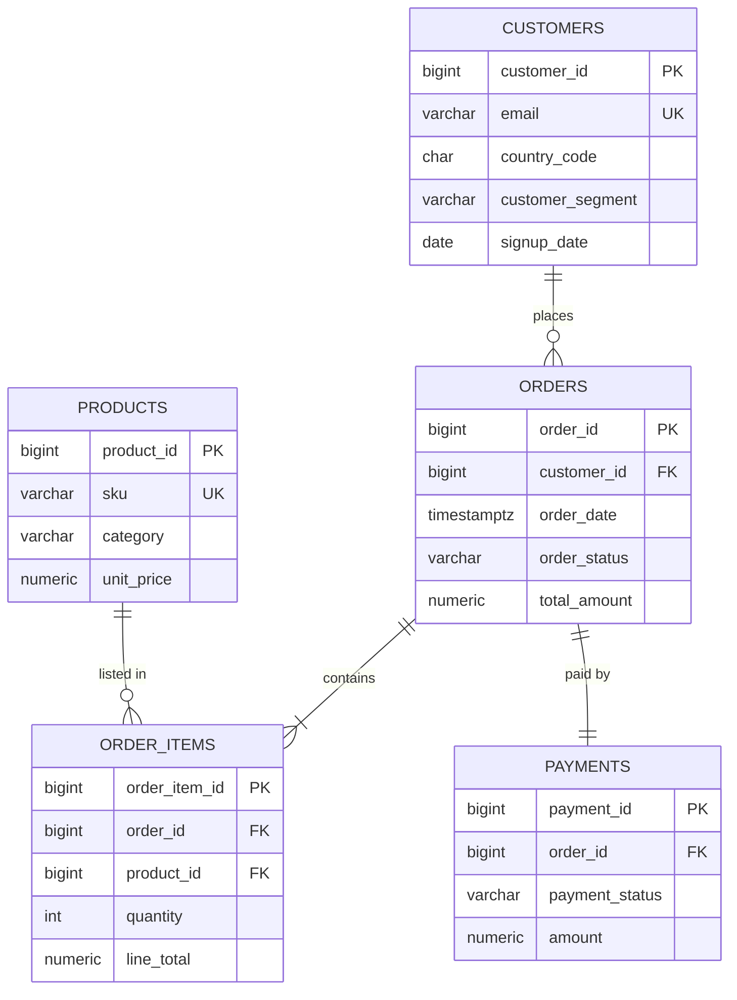

# Retail Lakehouse Data Platform

> End-to-end analytics platform for a fictional online retailer — built as a production-style portfolio project demonstrating modern data engineering practices.

[](https://www.python.org/downloads/)
[](https://github.com/farrukhrazzaqbutt/retail-lakehouse-data-platform/actions/workflows/ci.yml)
[]()

---

## Table of Contents

1. [Overview](#overview)
2. [Business Scenario](#business-scenario)
3. [Architecture](#architecture)
4. [Technology Stack](#technology-stack)
5. [Repository Structure](#repository-structure)
6. [Phase Roadmap](#phase-roadmap)
7. [Prerequisites](#prerequisites)
8. [Quick Start — Phase 1](#quick-start--phase-1)
9. [Configuration](#configuration)
10. [Data Model — Phase 1](#data-model--phase-1)
11. [Running Tests](#running-tests)
12. [Validation](#validation)
13. [Design Decisions](#design-decisions)
14. [Business Metrics (Phase 5 Gold)](#business-metrics-phase-5-gold)
15. [Contributing](#contributing)
16. [License](#license)

---

## Overview

This project simulates a full **Retail Lakehouse Data Platform** for an e-commerce company. Data flows from operational sources through a **Medallion Architecture** (Bronze → Silver → Gold) on **Delta Lake**, into **Snowflake** for warehousing, and through **dbt** for analytics marts — all orchestrated by **Apache Airflow**.

**Phase 1** establishes the **transactional source layer**. **Phase 2** adds **Azure Data Factory ingestion**. **Phase 4** adds **PySpark Silver transforms** with quarantine handling and Delta MERGE. **Phase 5** adds **Delta Lake Gold models** and business metric marts. **Phase 6** adds **Snowflake loading and setup** for the RAW warehouse layer. **Phase 7** adds **dbt staging, intermediate, and mart models** on Snowflake. **Phase 8** adds **Apache Airflow orchestration** and end-to-end reconciliation.

- Phase 1: synthetic data, PostgreSQL, Docker, tests
- Phase 2: CSV/JSON file sources, ADF pipelines, local ADLS mirror, ingestion metadata
- Phase 4: PySpark Silver validation, deduplication, quarantine Delta tables
- Phase 5: Gold dimensions, facts, and business metric marts (daily sales, CLV, segments)
- Phase 6: Snowflake database setup and Gold table loads into `RETAIL_DW.RAW`
- Phase 7: dbt staging/intermediate/marts with tests and RAW reconciliation
- Phase 8: Airflow DAGs orchestrating the full pipeline with reconciliation reports
- Phase 9: Testing hardening, CI/CD quality gates, runbooks, and contributor docs

---

## Business Scenario

**RetailCo** is a fictional global online retailer selling electronics, clothing, home goods, sports equipment, beauty products, and books. The platform tracks:

| Domain        | Description                                      |
|---------------|--------------------------------------------------|
| Customers     | Registration, geography, customer segments       |
| Products      | SKU catalog with categories and pricing          |
| Orders        | Order headers with status and monetary totals    |
| Order Items   | Line-level quantity, pricing, and discounts      |
| Payments      | Payment method, status, and transaction refs     |

Future phases may add **Databricks** cloud execution and production hardening.

Phase 2 adds **product update files** (CSV) and **website event streams** (JSON), ingested via **Azure Data Factory** into **ADLS Gen2**.

---

## Architecture

### Target State (All Phases)



### Phase 1 Scope



See [docs/architecture.md](docs/architecture.md) for detailed architecture notes and phase planning.

---

## Technology Stack

| Category            | Technologies                                              | Phase |
|---------------------|-----------------------------------------------------------|-------|
| Language            | Python 3.11+, SQL                                         | 1     |
| Data Generation     | Faker, Pandas, NumPy                                      | 1     |
| Source Database     | PostgreSQL 16                                             | 1     |
| Containerization    | Docker, Docker Compose                                    | 1     |
| Testing             | pytest                                                    | 1     |
| Ingestion           | Azure Data Factory, Azure Data Lake Storage               | 2     |
| Processing          | Databricks, PySpark, Delta Lake                           | 3     |
| Warehouse           | Snowflake, dbt                                            | 6–7   |
| Orchestration       | Apache Airflow                                            | 8     |
| CI/CD               | GitHub Actions                                            | 5     |
| Reconciliation      | Pandas reports                                            | 5     |

---

## Repository Structure

```
retail-lakehouse-data-platform/
├── adf/                         # Azure Data Factory JSON artifacts (Phase 2)
│   ├── linkedService/
│   ├── dataset/
│   ├── pipeline/
│   └── trigger/
├── .env.example                 # Environment variable template (no secrets)
├── .gitignore
├── README.md
├── docker-compose.yml           # PostgreSQL + optional Azurite (Phase 2)
├── pyproject.toml               # Project metadata and pytest config
├── requirements.txt
│
├── config/
│   ├── data_generation.yaml     # Volumes, distributions, categories
│   ├── postgres_tables.yaml     # Table metadata and load settings
│   ├── file_sources.yaml        # Phase 2 CSV/JSON generation
│   ├── adf_ingestion.yaml       # Phase 2 ingestion paths and tables
│   ├── silver_transforms.yaml   # Phase 4 Silver DQ rules
│   ├── gold_models.yaml         # Phase 5 Gold dimensions, facts, marts
│   └── snowflake_load.yaml      # Phase 6 Snowflake load order and settings
│
├── dbt/                         # Phase 7 dbt project
│   ├── dbt_project.yml
│   ├── profiles/profiles.yml
│   └── models/                  # staging, intermediate, marts
│
├── airflow/                     # Phase 8 Airflow DAGs
│   ├── Dockerfile
│   ├── dags/                    # setup, daily, health-check DAGs
│   └── include/task_commands.py
│
├── db/
│   └── init/
│       └── 01_schema.sql        # PostgreSQL DDL, constraints, indexes
│
├── sql/
│   └── snowflake/
│       ├── 01_setup.sql         # Phase 6 Snowflake database/schema setup
│       └── 02_dbt_schemas.sql   # Phase 7 dbt schema setup
│
├── docs/
│   ├── architecture.md          # Architecture decisions and phase plan
│   ├── phase2-adf-ingestion.md  # Phase 2 ADF ingestion
│   ├── phase4-silver-transforms.md  # Phase 4 Silver transforms
│   ├── phase5-gold-models.md    # Phase 5 Gold models and marts
│   ├── phase6-snowflake-load.md # Phase 6 Snowflake loading and setup
│   ├── phase7-dbt-models.md     # Phase 7 dbt staging/intermediate/marts
│   ├── phase8-airflow-orchestration.md  # Phase 8 Airflow DAGs
│   ├── phase9-testing-cicd-docs.md      # Phase 9 testing and CI/CD
│   └── runbooks/                        # Operator runbooks
│
├── scripts/
│   ├── generate_data.py         # Generate synthetic data → CSV
│   ├── load_postgres.py         # Generate/load data → PostgreSQL
│   ├── validate_phase1.py       # Phase 1 data quality checks
│   ├── generate_file_sources.py # Phase 2 CSV/JSON file sources
│   ├── run_local_ingestion.py   # Phase 2 local ADF mirror → ADLS layout
│   ├── validate_phase2.py       # Phase 2 landing zone validation
│   ├── run_silver_transforms.py  # Phase 4 Silver PySpark transforms
│   ├── validate_silver.py       # Phase 4 Silver + quarantine validation
│   ├── run_gold_models.py       # Phase 5 Gold dimensions, facts, marts
│   ├── validate_gold.py         # Phase 5 Gold layer validation
│   ├── setup_snowflake.py       # Phase 6 Snowflake database/schema setup
│   ├── run_snowflake_load.py    # Phase 6 Gold → Snowflake load
│   ├── validate_snowflake.py    # Phase 6 Snowflake validation
│   ├── setup_dbt_schemas.py     # Phase 7 Snowflake dbt schema setup
│   ├── run_dbt_models.py        # Phase 7 dbt run wrapper
│   ├── validate_dbt.py          # Phase 7 dbt compile/test validation
│   ├── run_reconciliation.py    # Phase 8 cross-layer reconciliation
│   └── run_ci_local.py          # Phase 9 local CI pipeline
│
├── src/
│   └── retail_lakehouse/
│       ├── config/              # Settings loaders (env + YAML)
│       ├── generators/          # Entity-specific data generators
│       ├── ingestion/           # Phase 2 metadata and landing pipelines
│       ├── transforms/          # Phase 4 Silver PySpark transforms
│       ├── gold/                # Phase 5 Gold models and business marts
│       ├── warehouse/           # Phase 6 Snowflake loading
│       ├── orchestration/       # Phase 8 reconciliation reporting
│       ├── spark/               # Spark session management
│       ├── loaders/             # PostgreSQL loader
│       ├── pipeline/            # Orchestration logic
│       └── utils/               # Logging and helpers
│
├── tests/
│   ├── conftest.py
│   └── unit/                    # pytest unit tests
│
└── data/
    ├── generated/               # Runtime output (gitignored)
    ├── file_sources/            # Phase 2 CSV/JSON staging (gitignored)
    ├── lakehouse/               # Phase 2 local ADLS mirror (gitignored)
    └── samples/                 # Small demo files (optional)
```

---

## Phase Roadmap

| Phase | Scope                                                              | Status      |
|-------|--------------------------------------------------------------------|-------------|
| **1** | Synthetic data, PostgreSQL, Docker, tests                          | ✅ Complete |
| **2** | CSV/JSON sources, Azure Data Factory, ADLS ingestion               | ✅ Complete |
| **4** | PySpark Silver transforms, quarantine, Delta MERGE                | ✅ Complete |
| **5** | Delta Lake Gold models, dimensions, facts, business metric marts | ✅ Complete |
| **6** | Snowflake setup and Gold table loading into RAW schema            | ✅ Complete |
| **7** | dbt staging, intermediate, and mart models with tests             | ✅ Complete |
| **8** | Airflow orchestration, reconciliation, GitHub Actions CI          | ✅ Complete |
| **9** | Testing, CI/CD quality gates, runbooks, contributor documentation | ✅ Complete |

---

## Prerequisites

- **Python 3.11+** (tested on 3.11–3.14)
- **Docker Desktop** (or Docker Engine + Compose plugin)
- **Git**

> **Note:** Default PostgreSQL port is **55432** to avoid conflicts with local PostgreSQL installations. Override via `POSTGRES_PORT` in `.env`.

---

## Quick Start — Phase 1

### 1. Clone and configure

```bash
git clone <your-repo-url> retail-lakehouse-data-platform
cd retail-lakehouse-data-platform

python -m venv .venv

# Windows (PowerShell)
.venv\Scripts\Activate.ps1

# macOS / Linux
source .venv/bin/activate

pip install -r requirements.txt
cp .env.example .env   # Linux/macOS
# copy .env.example .env   # Windows
```

Edit `.env` and set `POSTGRES_PASSWORD` (and optionally adjust volume settings).

### 2. Start PostgreSQL

```bash
docker compose up -d
docker compose ps
```

Wait until the `retail-postgres` container is **healthy**.

### 3. Generate synthetic data (CSV export)

```bash
# Full default volumes (5K customers, 500 products, 25K orders)
python scripts/generate_data.py

# Smaller dataset for quick iteration
python scripts/generate_data.py --customers 100 --products 50 --orders 500
```

Output is written to `data/generated/` (gitignored).

### 4. Load data into PostgreSQL

```bash
python scripts/load_postgres.py --truncate --customers 100 --products 50 --orders 500
```

Or load from previously generated CSV files:

```bash
python scripts/load_postgres.py --truncate --from-csv data/generated
```

### 5. Validate

```bash
python scripts/validate_phase1.py
```

Expected output: all referential integrity and data-quality checks **PASS**.

### 6. Inspect data (optional)

```bash
docker exec -it retail-postgres psql -U retail_user -d retail_db -c "SELECT * FROM retail.v_table_counts;"
```

Connect from your host using port **55432** (see `.env`).

---

## Quick Start — Phase 2

### 1. Ensure Phase 1 data is loaded

```bash
docker compose up -d
python scripts/load_postgres.py --truncate --customers 100 --products 50 --orders 500
python scripts/validate_phase1.py
```

### 2. Generate file sources (CSV + JSON)

```bash
python scripts/generate_file_sources.py --products 50 --customers 100
```

Output: `data/file_sources/product_updates/` and `data/file_sources/website_events/`

### 3. Run local ingestion (ADF mirror)

```bash
python scripts/run_local_ingestion.py
```

Lands partitioned data to `data/lakehouse/raw/bronze/`

### 4. Validate Phase 2

```bash
python scripts/validate_phase2.py
```

### 5. Deploy to Azure (optional)

Import ADF artifacts from `adf/` into your Data Factory instance. See [adf/README.md](adf/README.md) and [docs/phase2-adf-ingestion.md](docs/phase2-adf-ingestion.md).

To upload local landing files to Azure Storage:

```bash
python scripts/run_local_ingestion.py --upload-azure
```

Requires `AZURE_STORAGE_ACCOUNT` and Azure credentials in `.env`.

---

## Quick Start — Phase 4

### 1. Ensure Bronze data exists (Phase 2)

```bash
python scripts/run_local_ingestion.py
python scripts/validate_phase2.py
```

### 2. Run Silver transforms

```bash
python scripts/run_silver_transforms.py
```

### 3. Validate Silver + quarantine

```bash
python scripts/validate_silver.py
pytest tests/unit/transforms/
```

See [docs/phase4-silver-transforms.md](docs/phase4-silver-transforms.md) for data quality rules and Databricks deployment notes.

> **Requires Java 11+** for local Spark execution.

---

## Quick Start — Phase 5

### 1. Ensure Silver tables exist (Phase 4)

```bash
python scripts/run_silver_transforms.py
python scripts/validate_silver.py
```

### 2. Run Gold models

```bash
python scripts/run_gold_models.py
```

### 3. Validate Gold marts

```bash
python scripts/validate_gold.py
pytest tests/unit/gold/
```

See [docs/phase5-gold-models.md](docs/phase5-gold-models.md) for the Gold data model and business metrics.

> **Requires Java 11+** for local Spark execution.

---

## Quick Start — Phase 6

### 1. Configure Snowflake credentials

```bash
cp .env.example .env
# Set SNOWFLAKE_ACCOUNT, SNOWFLAKE_USER, SNOWFLAKE_PASSWORD, etc.
```

### 2. Ensure Gold tables exist (Phase 5)

```bash
python scripts/run_gold_models.py
python scripts/validate_gold.py
```

### 3. Provision Snowflake database and schema

```bash
python scripts/setup_snowflake.py
```

### 4. Load Gold tables into Snowflake

```bash
python scripts/run_snowflake_load.py
```

### 5. Validate Snowflake row counts

```bash
python scripts/validate_snowflake.py
pytest tests/unit/warehouse/
```

See [docs/phase6-snowflake-load.md](docs/phase6-snowflake-load.md) for setup SQL, load modes, and deployment notes.

> **Requires Java 11+** for reading Gold Delta tables. Snowflake credentials required for setup and load (use `--dry-run` to validate Gold sources only).

---

## Quick Start — Phase 7

### 1. Ensure Snowflake RAW tables exist (Phase 6)

```bash
python scripts/run_snowflake_load.py
python scripts/validate_snowflake.py
```

### 2. Install dbt

```bash
pip install -r requirements-dbt.txt
```

### 3. Create dbt schemas

```bash
python scripts/setup_dbt_schemas.py
```

### 4. Run dbt models

```bash
python scripts/run_dbt_models.py
```

### 5. Validate

```bash
python scripts/validate_dbt.py --compile-only
python scripts/validate_dbt.py
pytest tests/unit/dbt/
```

See [docs/phase7-dbt-models.md](docs/phase7-dbt-models.md) for model inventory, tests, and deployment notes.

---

## Quick Start — Phase 8

### 1. Generate Airflow Fernet key

```bash
python -c "from cryptography.fernet import Fernet; print(Fernet.generate_key().decode())"
# Add output to .env as AIRFLOW__CORE__FERNET_KEY
```

### 2. Start Airflow (Docker)

```bash
docker compose --profile airflow up -d
```

Airflow UI: **http://localhost:8080** (default `admin` / `admin`)

### 3. Run setup DAG (once)

Unpause and trigger `retail_platform_setup` in the Airflow UI.

### 4. Run daily pipeline

Unpause `retail_daily_pipeline` or trigger manually.

### 5. Reconciliation report

```bash
python scripts/run_reconciliation.py
pytest tests/unit/airflow/ tests/unit/orchestration/
```

See [docs/phase8-airflow-orchestration.md](docs/phase8-airflow-orchestration.md) for DAG details, Docker services, and CI setup.

---

## Quick Start — Phase 9

### 1. Install dev tooling

```bash
pip install -r requirements-dev.txt
pre-commit install   # optional
```

### 2. Run local CI

```bash
python scripts/run_ci_local.py
```

### 3. View CI pipeline

GitHub Actions workflow: `.github/workflows/ci.yml`

Jobs: `lint` → `typecheck` → `test` → `test-spark` → `coverage` → `dbt` → `airflow`

See [docs/phase9-testing-cicd-docs.md](docs/phase9-testing-cicd-docs.md) and [docs/runbooks/](docs/runbooks/) for full documentation.

---

## Configuration

| Source                    | Purpose                                           |
|---------------------------|---------------------------------------------------|
| `.env`                    | Secrets and runtime overrides (never committed)   |
| `config/data_generation.yaml` | Distributions, categories, default volumes  |
| `config/postgres_tables.yaml` | Table names, batch size, source system label  |
| `config/silver_transforms.yaml` | Phase 4 Silver DQ rules and entity config |
| `config/gold_models.yaml` | Phase 5 Gold dimensions, facts, marts, business rules |
| `config/snowflake_load.yaml` | Phase 6 Snowflake load order, modes, manifest paths |
| `dbt/dbt_project.yml` | Phase 7 dbt project config, vars, model materializations |

**Environment variables** override YAML defaults for volumes and date ranges:

| Variable              | Default       | Description                    |
|-----------------------|---------------|--------------------------------|
| `NUM_CUSTOMERS`       | 5000          | Customer record count          |
| `NUM_PRODUCTS`        | 500           | Product catalog size           |
| `NUM_ORDERS`          | 25000         | Order header count             |
| `DATA_GENERATION_SEED`| 42            | RNG seed for reproducibility   |
| `ORDER_START_DATE`    | 2023-01-01    | Earliest order/signup date     |
| `ORDER_END_DATE`      | 2025-06-30    | Latest order date              |

---

## Data Model — Phase 1

### Entity Relationship



### Audit Columns

All tables include `created_at`, `source_system`, and (where applicable) `updated_at` — preparing for downstream ingestion metadata in later phases.

---

## Running Tests

```bash
# Fast unit tests (no Java required)
pytest -m "not spark" -q

# Spark tests (Java 17+ required)
pytest -m spark -q

# Full suite with coverage (60% minimum)
pytest --cov=retail_lakehouse --cov-report=term-missing

# Local CI pipeline (lint + typecheck + tests + coverage)
python scripts/run_ci_local.py
```

| Suite | Location | Requires |
|-------|----------|----------|
| Generators & pipeline | `tests/unit/test_*.py` | Python only |
| Silver transforms | `tests/unit/transforms/` | Java + PySpark |
| Gold models | `tests/unit/gold/` | Java + PySpark |
| Snowflake load | `tests/unit/warehouse/` | Java + PySpark |
| dbt project | `tests/unit/dbt/` | Python + PyYAML |
| Airflow DAGs | `tests/unit/airflow/` | Python (+ Airflow for import test) |
| Script smoke | `tests/unit/scripts/` | Python only |
| Config integration | `tests/integration/` | Python only |

See [docs/phase9-testing-cicd-docs.md](docs/phase9-testing-cicd-docs.md) and [CONTRIBUTING.md](CONTRIBUTING.md).

---

## Validation

`scripts/validate_phase1.py` runs SQL checks for:

- Orphan foreign keys (orders → customers, items → orders/products, payments → orders)
- Negative monetary amounts
- Duplicate customer emails
- Orders without line items

---

## Design Decisions

| Decision | Rationale |
|----------|-----------|
| **PostgreSQL as source of truth** | Represents operational OLTP data realistically; ADF ingests it in Phase 2 |
| **YAML + `.env` configuration** | Separates non-secret defaults from secrets; supports interview discussion of 12-factor apps |
| **Modular generators per entity** | Each domain is testable in isolation; mirrors micro-batch ETL patterns |
| **Reproducible RNG (`seed`)** | Enables deterministic tests and demo datasets |
| **Order amounts computed from line items** | Preserves referential and arithmetic consistency |
| **Payment status derived from order status** | Creates realistic correlations for future metric modeling |
| **Truncate + reload for idempotency** | Phase 1 full-load pattern; incremental loads come in later phases |
| **`src/` layout** | Standard Python packaging; clean separation from scripts and infra |
| **No large data in Git** | `data/generated/` is gitignored; samples only when small |

---

## Business Metrics (Phase 5 Gold)

The Gold layer delivers analytics-ready marts with:

- Daily and monthly revenue
- Net revenue after cancellations and refunds
- Average order value (AOV)
- Customer lifetime value (CLV)
- Repeat purchase rate
- Cancellation and payment failure rates
- Product category performance
- Revenue by country and customer segment
- Monthly active customers
- New vs. returning customers

**Gold marts:** `mart_daily_sales`, `mart_monthly_revenue`, `mart_customer_lifetime_value`, `mart_product_performance`, `mart_customer_segments`

Phase 7 delivers these marts in **dbt** (`RETAIL_DW.MARTS`) with staging and intermediate layers, plus dbt tests and RAW reconciliation.

Phase 8 orchestrates the full pipeline with **Apache Airflow** DAGs and cross-layer **reconciliation** reports.

Phase 9 adds **CI/CD quality gates**, expanded tests, runbooks, and contributor documentation — making the platform portfolio-ready.

---

## Contributing

See [CONTRIBUTING.md](CONTRIBUTING.md) for development setup, quality gates, and PR guidelines.

1. Create a feature branch from `main`
2. Run `python scripts/run_ci_local.py` before opening a PR
3. Follow existing patterns: type hints, docstrings, config-driven design
4. Never commit `.env` or generated data

---

## License

MIT License — see [LICENSE](LICENSE).

---

## Author

Built as a portfolio project demonstrating end-to-end data engineering for technical interviews and production readiness discussions.
