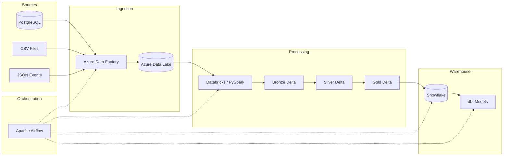
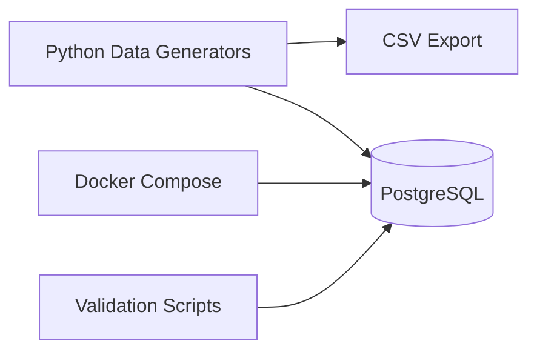
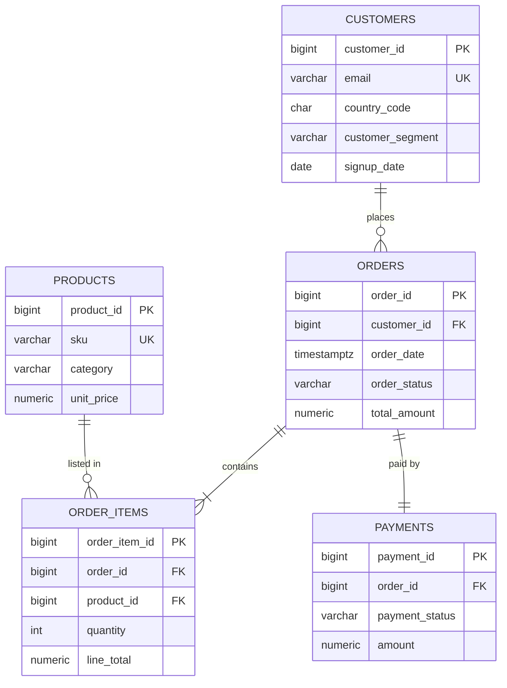

# Retail Lakehouse Data Platform

> End-to-end analytics platform for a fictional online retailer — built as a production-style portfolio project demonstrating modern data engineering practices.

[](https://www.python.org/downloads/)
[]()

---

## Table of Contents

1. [Overview](#overview)
2. [Business Scenario](#business-scenario)
3. [Architecture](#architecture)
4. [Technology Stack](#technology-stack)
5. [Repository Structure](#repository-structure)
6. [Phase Roadmap](#phase-roadmap)
7. [Prerequisites](#prerequisites)
8. [Quick Start — Phase 1](#quick-start--phase-1)
9. [Configuration](#configuration)
10. [Data Model — Phase 1](#data-model--phase-1)
11. [Running Tests](#running-tests)
12. [Validation](#validation)
13. [Design Decisions](#design-decisions)
14. [Business Metrics (Future Phases)](#business-metrics-future-phases)
15. [Contributing](#contributing)
16. [License](#license)

---

## Overview

This project simulates a full **Retail Lakehouse Data Platform** for an e-commerce company. Data flows from operational sources through a **Medallion Architecture** (Bronze → Silver → Gold) on **Delta Lake**, into **Snowflake** for warehousing, and through **dbt** for analytics marts — all orchestrated by **Apache Airflow**.

**Phase 1** (current) establishes the **transactional source layer**:

- Realistic synthetic data generation (Python, Faker, Pandas, NumPy)
- PostgreSQL as the system-of-record for customers, products, orders, order items, and payments
- Docker Compose for local PostgreSQL
- Unit tests and validation scripts

---

## Business Scenario

**RetailCo** is a fictional global online retailer selling electronics, clothing, home goods, sports equipment, beauty products, and books. The platform tracks:

| Domain        | Description                                      |
|---------------|--------------------------------------------------|
| Customers     | Registration, geography, customer segments       |
| Products      | SKU catalog with categories and pricing          |
| Orders        | Order headers with status and monetary totals    |
| Order Items   | Line-level quantity, pricing, and discounts      |
| Payments      | Payment method, status, and transaction refs     |

Future phases add **product update files** (CSV/JSON) and **website event streams** (JSON).

---

## Architecture

### Target State (All Phases)



### Phase 1 Scope



See [docs/architecture.md](docs/architecture.md) for detailed architecture notes and phase planning.

---

## Technology Stack

| Category            | Technologies                                              | Phase |
|---------------------|-----------------------------------------------------------|-------|
| Language            | Python 3.11+, SQL                                         | 1     |
| Data Generation     | Faker, Pandas, NumPy                                      | 1     |
| Source Database     | PostgreSQL 16                                             | 1     |
| Containerization    | Docker, Docker Compose                                    | 1     |
| Testing             | pytest                                                    | 1     |
| Ingestion           | Azure Data Factory, Azure Data Lake Storage               | 2     |
| Processing          | Databricks, PySpark, Delta Lake                           | 3     |
| Warehouse           | Snowflake, dbt                                            | 4     |
| Orchestration       | Apache Airflow                                            | 5     |
| CI/CD               | GitHub Actions                                            | 5     |
| Reconciliation      | Pandas reports                                            | 5     |

---

## Repository Structure

```
retail-lakehouse-data-platform/
├── .env.example                 # Environment variable template (no secrets)
├── .gitignore
├── README.md
├── docker-compose.yml           # PostgreSQL service (Phase 1)
├── pyproject.toml               # Project metadata and pytest config
├── requirements.txt
│
├── config/
│   ├── data_generation.yaml     # Volumes, distributions, categories
│   └── postgres_tables.yaml     # Table metadata and load settings
│
├── db/
│   └── init/
│       └── 01_schema.sql        # PostgreSQL DDL, constraints, indexes
│
├── docs/
│   └── architecture.md          # Architecture decisions and phase plan
│
├── scripts/
│   ├── generate_data.py         # Generate synthetic data → CSV
│   ├── load_postgres.py         # Generate/load data → PostgreSQL
│   └── validate_phase1.py       # Data quality validation queries
│
├── src/
│   └── retail_lakehouse/
│       ├── config/              # Settings loaders (env + YAML)
│       ├── generators/          # Entity-specific data generators
│       ├── loaders/             # PostgreSQL loader
│       ├── pipeline/            # Orchestration logic
│       └── utils/               # Logging and helpers
│
├── tests/
│   ├── conftest.py
│   └── unit/                    # pytest unit tests
│
└── data/
    ├── generated/               # Runtime output (gitignored)
    └── samples/                 # Small demo files (optional)
```

---

## Phase Roadmap

| Phase | Scope                                                              | Status      |
|-------|--------------------------------------------------------------------|-------------|
| **1** | Synthetic data, PostgreSQL, Docker, tests                          | ✅ Complete |
| 2     | CSV/JSON sources, Azure Data Factory, ADLS ingestion               | Planned     |
| 3     | Databricks Medallion (Bronze/Silver/Gold), Delta Lake features     | Planned     |
| 4     | Snowflake load, dbt staging/intermediate/marts, tests, snapshots   | Planned     |
| 5     | Airflow orchestration, reconciliation, GitHub Actions, full docs   | Planned     |

---

## Prerequisites

- **Python 3.11+** (tested on 3.11–3.14)
- **Docker Desktop** (or Docker Engine + Compose plugin)
- **Git**

> **Note:** Default PostgreSQL port is **55432** to avoid conflicts with local PostgreSQL installations. Override via `POSTGRES_PORT` in `.env`.

---

## Quick Start — Phase 1

### 1. Clone and configure

```bash
git clone <your-repo-url> retail-lakehouse-data-platform
cd retail-lakehouse-data-platform

python -m venv .venv

# Windows (PowerShell)
.venv\Scripts\Activate.ps1

# macOS / Linux
source .venv/bin/activate

pip install -r requirements.txt
cp .env.example .env   # Linux/macOS
# copy .env.example .env   # Windows
```

Edit `.env` and set `POSTGRES_PASSWORD` (and optionally adjust volume settings).

### 2. Start PostgreSQL

```bash
docker compose up -d
docker compose ps
```

Wait until the `retail-postgres` container is **healthy**.

### 3. Generate synthetic data (CSV export)

```bash
# Full default volumes (5K customers, 500 products, 25K orders)
python scripts/generate_data.py

# Smaller dataset for quick iteration
python scripts/generate_data.py --customers 100 --products 50 --orders 500
```

Output is written to `data/generated/` (gitignored).

### 4. Load data into PostgreSQL

```bash
python scripts/load_postgres.py --truncate --customers 100 --products 50 --orders 500
```

Or load from previously generated CSV files:

```bash
python scripts/load_postgres.py --truncate --from-csv data/generated
```

### 5. Validate

```bash
python scripts/validate_phase1.py
```

Expected output: all referential integrity and data-quality checks **PASS**.

### 6. Inspect data (optional)

```bash
docker exec -it retail-postgres psql -U retail_user -d retail_db -c "SELECT * FROM retail.v_table_counts;"
```

Connect from your host using port **55432** (see `.env`).

---

## Configuration

| Source                    | Purpose                                           |
|---------------------------|---------------------------------------------------|
| `.env`                    | Secrets and runtime overrides (never committed)   |
| `config/data_generation.yaml` | Distributions, categories, default volumes  |
| `config/postgres_tables.yaml` | Table names, batch size, source system label  |

**Environment variables** override YAML defaults for volumes and date ranges:

| Variable              | Default       | Description                    |
|-----------------------|---------------|--------------------------------|
| `NUM_CUSTOMERS`       | 5000          | Customer record count          |
| `NUM_PRODUCTS`        | 500           | Product catalog size           |
| `NUM_ORDERS`          | 25000         | Order header count             |
| `DATA_GENERATION_SEED`| 42            | RNG seed for reproducibility   |
| `ORDER_START_DATE`    | 2023-01-01    | Earliest order/signup date     |
| `ORDER_END_DATE`      | 2025-06-30    | Latest order date              |

---

## Data Model — Phase 1

### Entity Relationship



### Audit Columns

All tables include `created_at`, `source_system`, and (where applicable) `updated_at` — preparing for downstream ingestion metadata in later phases.

---

## Running Tests

```bash
pytest
pytest --cov=retail_lakehouse --cov-report=term-missing
```

Tests cover generators, referential integrity, reproducibility, configuration loading, and CSV export.

---

## Validation

`scripts/validate_phase1.py` runs SQL checks for:

- Orphan foreign keys (orders → customers, items → orders/products, payments → orders)
- Negative monetary amounts
- Duplicate customer emails
- Orders without line items

---

## Design Decisions

| Decision | Rationale |
|----------|-----------|
| **PostgreSQL as source of truth** | Represents operational OLTP data realistically; ADF ingests it in Phase 2 |
| **YAML + `.env` configuration** | Separates non-secret defaults from secrets; supports interview discussion of 12-factor apps |
| **Modular generators per entity** | Each domain is testable in isolation; mirrors micro-batch ETL patterns |
| **Reproducible RNG (`seed`)** | Enables deterministic tests and demo datasets |
| **Order amounts computed from line items** | Preserves referential and arithmetic consistency |
| **Payment status derived from order status** | Creates realistic correlations for future metric modeling |
| **Truncate + reload for idempotency** | Phase 1 full-load pattern; incremental loads come in later phases |
| **`src/` layout** | Standard Python packaging; clean separation from scripts and infra |
| **No large data in Git** | `data/generated/` is gitignored; samples only when small |

---

## Business Metrics (Future Phases)

The Gold layer and dbt marts will deliver:

- Daily and monthly revenue
- Net revenue after cancellations and refunds
- Average order value (AOV)
- Customer lifetime value (CLV)
- Repeat purchase rate
- Cancellation and payment failure rates
- Product category performance
- Revenue by country
- Monthly active customers
- New vs. returning customers

**Target marts:** `mart_daily_sales`, `mart_monthly_revenue`, `mart_customer_lifetime_value`, `mart_product_performance`, `mart_customer_segments`

---

## Contributing

1. Create a feature branch from `main`
2. Run `pytest` before opening a PR
3. Follow existing patterns: type hints, docstrings, config-driven design
4. Never commit `.env` or generated data

---

## License

MIT License — see [LICENSE](LICENSE) (to be added in a future phase).

---

## Author

Built as a portfolio project demonstrating end-to-end data engineering for technical interviews and production readiness discussions.
