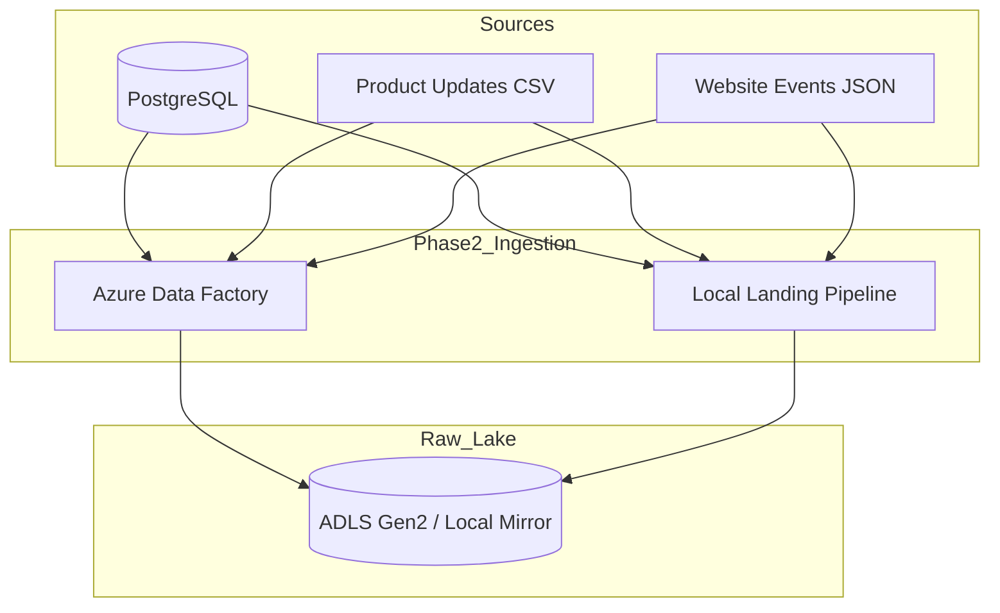

# Phase 2 — Azure Data Factory Ingestion

> Ingest PostgreSQL tables and file sources (CSV/JSON) into a partitioned ADLS raw landing zone.

## Overview

Phase 2 extends the platform with:

1. **File-based sources** — product update CSV feeds and website event JSON streams
2. **Azure Data Factory pipelines** — production-grade ingestion into ADLS Gen2
3. **Local ingestion mirror** — runnable Python pipeline matching ADF path conventions
4. **Ingestion metadata** — `batch_id`, `source_system`, `source_file`, `ingested_at`, `ingestion_date`

## Architecture



## Data Flow

```
1. generate_file_sources.py  →  data/file_sources/{product_updates,website_events}/
2. run_local_ingestion.py    →  data/lakehouse/raw/bronze/{postgres,file}/...
3. validate_phase2.py        →  row counts + metadata checks
```

Production path replaces step 2 with `PL_Master_Ingestion` in Azure Data Factory.

## Landing Zone Paths

| Source | Path Pattern |
|--------|--------------|
| PostgreSQL tables | `bronze/postgres/{table}/ingestion_date={date}/batch_id={id}/{table}.parquet` |
| Product updates | `bronze/file/product_updates/ingestion_date={date}/batch_id={id}/` |
| Website events | `bronze/file/website_events/ingestion_date={date}/batch_id={id}/` |
| Manifest | `bronze/_manifests/ingestion_date={date}/batch_id={id}.json` |

## Quick Start

### Prerequisites

- Phase 1 complete (PostgreSQL running with data loaded)
- Python dependencies installed (`pip install -r requirements.txt`)

### Step 1 — Generate file sources

```bash
python scripts/generate_file_sources.py --products 50 --customers 100
```

### Step 2 — Run local ingestion

```bash
python scripts/run_local_ingestion.py
```

### Step 3 — Validate

```bash
python scripts/validate_phase2.py
```

### Step 4 — Deploy ADF (Azure)

See [adf/README.md](../adf/README.md) for linked services, datasets, pipelines, and trigger deployment.

## Configuration

| File | Purpose |
|------|---------|
| `config/file_sources.yaml` | CSV/JSON generation settings |
| `config/adf_ingestion.yaml` | Table list, paths, metadata, load modes |
| `.env` | Azure credentials and landing directory overrides |

## Load Modes

| Table | Mode | Watermark |
|-------|------|-----------|
| customers | full | `updated_at` |
| products | incremental | `updated_at` |
| orders | incremental | `updated_at` |
| order_items | full | — |
| payments | incremental | `updated_at` |

Incremental mode is configured for ADF; local full extracts are used by default in `run_local_ingestion.py` unless watermarks are passed programmatically.

## Design Decisions

| Decision | Rationale |
|----------|-----------|
| **Partitioned raw paths** | Enables date-scoped Bronze processing in Phase 3 |
| **Metadata at ingest** | Lineage and reconciliation without modifying source systems |
| **ADF + local mirror** | Portfolio is demoable without Azure spend; production path is still realistic |
| **Parquet for PostgreSQL** | Columnar format efficient for Spark/Databricks downstream |
| **Parameterized ADF JSON** | No hard-coded storage accounts; interview-ready IaC |

## Interview Talking Points

1. How ADF `additionalColumns` maps to Bronze metadata requirements.
2. Why file sources land separately from PostgreSQL (`source_type` partition).
3. How `batch_id` enables idempotent reprocessing and audit trails.
4. Trade-off: ADF orchestration vs. custom Python (operational overhead vs. flexibility).

---

*Phase 2 — Azure Data Factory Ingestion*
