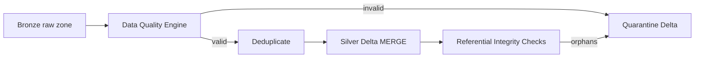

# Phase 4 — PySpark Silver Transforms & Quarantine

> Clean, validate, deduplicate Bronze data into Silver Delta tables; route invalid records to quarantine.

## Overview

Phase 4 implements the **Silver layer** of the Medallion architecture:

- Read Bronze Parquet/CSV/JSON from the Phase 2 landing zone
- Apply **data quality rules** (nulls, accepted values, numeric bounds, duplicates)
- Enforce **referential integrity** across entities
- **Deduplicate** on primary key (latest `ingested_at` wins)
- Write valid rows to **Silver Delta** tables via MERGE
- Route invalid rows to **quarantine Delta** tables with `rejection_reason`

## Architecture



## Package Layout

```
src/retail_lakehouse/
├── spark/session.py           # Spark + Delta session factory
└── transforms/
    ├── bronze_reader.py       # Read partitioned Bronze data
    ├── quality.py             # Validation + quarantine split
    ├── dedupe.py              # Latest-record deduplication
    ├── silver_writer.py       # Delta MERGE + quarantine append
    └── pipeline.py            # Orchestrator

config/silver_transforms.yaml  # Per-entity DQ rules
scripts/run_silver_transforms.py
scripts/validate_silver.py
```

## Output Paths

| Layer | Path |
|-------|------|
| Silver Delta | `data/lakehouse/silver/silver/{source_type}/{entity}/` |
| Quarantine | `data/lakehouse/silver/silver/_quarantine/{entity}/ingestion_date=.../batch_id=.../` |
| Manifest | `data/lakehouse/silver/silver/_manifests/ingestion_date=.../batch_id=....json` |

## Quick Start

### Prerequisites

- Phase 2 Bronze data landed (`scripts/run_local_ingestion.py`)
- Java 11+ (required by Spark)
- `pip install -r requirements.txt`

### Run Silver transforms

```bash
python scripts/run_silver_transforms.py
python scripts/validate_silver.py
pytest tests/unit/transforms/
```

### Process specific entities

```bash
python scripts/run_silver_transforms.py --entities customers,products,orders
```

## Data Quality Rules

| Check | Example |
|-------|---------|
| Required columns | `customer_id`, `email` not null |
| Accepted values | `order_status` ∈ {completed, cancelled, ...} |
| Numeric bounds | `unit_price > 0`, `quantity > 0` |
| Duplicates | Flag duplicate PKs within batch → quarantine |
| Referential integrity | Orphan `customer_id` in orders → quarantine |

Quarantine records include `rejection_reason` (pipe-delimited when multiple violations).

## Silver Columns Added

- `processed_at` — UTC timestamp when Silver transform ran
- Bronze metadata preserved: `batch_id`, `source_system`, `source_file`, `ingested_at`, `ingestion_date`

## Delta Lake Features Demonstrated

- **MERGE** — Upsert into Silver tables on primary key (idempotent re-runs)
- **Append** — Quarantine tables accumulate rejected records per batch
- **Schema enforcement** — Validation before write

## Databricks Deployment

Use the same Python modules in a Databricks notebook or job:

```python
from retail_lakehouse.spark.session import get_spark_session
from retail_lakehouse.config.settings import load_silver_transform_config
from retail_lakehouse.transforms.pipeline import SilverTransformPipeline

spark = get_spark_session(app_name="retail-silver", master="databricks")
config = load_silver_transform_config()
SilverTransformPipeline(spark, config).run()
```

Set `SILVER_BRONZE_ROOT` and `SILVER_OUTPUT_ROOT` to DBFS/Unity Catalog paths.

## Interview Talking Points

1. **Why quarantine instead of dropping bad rows?** Auditability and data steward workflows.
2. **Why dedupe in Silver not Bronze?** Bronze preserves raw history; Silver is curated and current-state.
3. **Why Delta MERGE?** Idempotent pipeline re-runs without duplicate Silver records.
4. **Processing order** — customers → products → orders → order_items → payments respects FK dependencies.

---

*Phase 4 — PySpark Silver Transforms*
