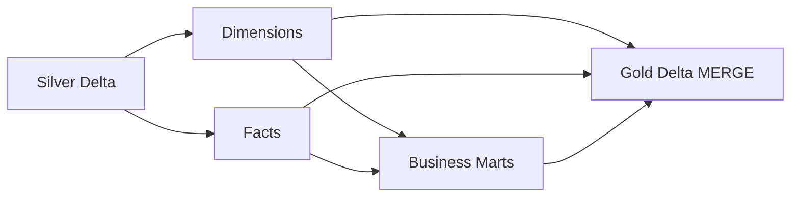

# Phase 5 — Delta Lake Gold Models & Business Metrics

> Curated dimensions, facts, and business metric marts built from Silver Delta tables.

## Overview

Phase 5 implements the **Gold layer** of the Medallion architecture:

- Read curated **Silver Delta** postgres entities
- Build conformed **dimensions** (`dim_date`, `dim_customers`, `dim_products`, `dim_country`)
- Build **facts** with revenue and payment flags (`fct_orders`, `fct_order_items`, `fct_payments`)
- Materialize **business metric marts** for analytics and BI
- Write all outputs as **Delta Lake** tables with MERGE semantics
- Persist a JSON **manifest** per pipeline run

## Architecture



## Package Layout

```
src/retail_lakehouse/gold/
├── silver_reader.py    # Read Silver postgres entities
├── dimensions.py       # dim_date, dim_customers, dim_products, dim_country
├── facts.py            # fct_orders, fct_order_items, fct_payments
├── marts.py            # Business metric marts
├── gold_writer.py      # Delta MERGE / overwrite writer
├── schemas.py          # Explicit PySpark schemas for dimensions
└── pipeline.py         # Orchestrator

config/gold_models.yaml
scripts/run_gold_models.py
scripts/validate_gold.py
```

## Output Paths

| Layer | Path |
|-------|------|
| Dimensions | `data/lakehouse/gold/gold/dimensions/{table}/` |
| Facts | `data/lakehouse/gold/gold/facts/{table}/` |
| Marts | `data/lakehouse/gold/gold/marts/{table}/` |
| Manifest | `data/lakehouse/gold/gold/_manifests/gold_run_{batch_id}.json` |

## Gold Data Model

### Dimensions

| Table | Description |
|-------|-------------|
| `dim_date` | Conformed calendar (2023–2026) with week/quarter attributes |
| `dim_customers` | Customer attributes and segment |
| `dim_products` | Product catalog with pricing |
| `dim_country` | Distinct countries from customer base |

### Facts

| Table | Description |
|-------|-------------|
| `fct_orders` | Order grain with gross/net revenue flags and status indicators |
| `fct_order_items` | Line-item grain with quantity and line totals |
| `fct_payments` | Payment grain with success/failure flags |

### Business Metric Marts

| Mart | Metrics |
|------|---------|
| `mart_daily_sales` | Gross/net revenue, order counts, AOV, payment failure rate, cancellation rate |
| `mart_monthly_revenue` | Monthly revenue, active customers, new vs returning customers |
| `mart_customer_lifetime_value` | Total orders, revenue, net revenue, AOV, repeat purchase rate |
| `mart_product_performance` | Quantity sold, gross/net revenue by product and category |
| `mart_customer_segments` | Segment and country metrics: revenue, AOV, repeat rate, cancellation rate |

## Business Rules

Configured in `config/gold_models.yaml`:

| Rule | Default values |
|------|----------------|
| Completed orders | `completed` |
| Cancelled orders | `cancelled` |
| Refunded orders | `refunded` |
| Successful payments | `succeeded` |
| Failed payments | `failed` |

**Revenue logic:**

- **Gross revenue** — counted for completed and refunded orders
- **Net revenue** — counted only for completed orders (cancelled/refunded contribute zero)

## Quick Start

### Prerequisites

- Phase 4 Silver tables (`scripts/run_silver_transforms.py`)
- Java 11+ (required by Spark)
- `pip install -r requirements.txt`

### Run Gold models

```bash
python scripts/run_gold_models.py
python scripts/validate_gold.py
pytest tests/unit/gold/
```

### Run with batch manifest

```bash
python scripts/run_gold_models.py --batch-id retail_gold_20260711
```

## End-to-End Pipeline

```bash
# Phase 1 — source data
python scripts/generate_data.py
python scripts/load_postgres.py

# Phase 2 — Bronze ingestion
python scripts/run_local_ingestion.py

# Phase 4 — Silver transforms
python scripts/run_silver_transforms.py

# Phase 5 — Gold models
python scripts/run_gold_models.py
python scripts/validate_gold.py
```

## Databricks Deployment Notes

- Replace local `silver_root` / `gold_root` paths with Unity Catalog volumes or external locations
- Schedule as a Databricks job after Silver processing completes
- Use `MERGE` semantics on dimensions and facts for incremental refreshes
- Marts use `overwrite` (segment mart) or `merge` (date-keyed marts) depending on grain

## Next Phase

Phase 6 will load Gold tables into **Snowflake** and build **dbt** staging, intermediate, and mart models with tests and documentation.
