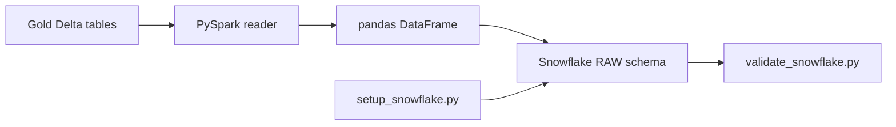

# Phase 6 — Snowflake Loading & Setup

> Load Gold Delta dimensions, facts, and business marts into Snowflake RAW schema.

## Overview

Phase 6 implements the **warehouse landing layer**:

- Provision Snowflake database, schema, and role grants
- Read **Gold Delta** tables from the local lakehouse
- Auto-create Snowflake tables from Spark schemas
- Load 12 Gold tables into `RETAIL_DW.RAW` with overwrite semantics
- Persist a JSON **manifest** per load run
- Validate row counts against Gold sources

## Architecture



## Package Layout

```
src/retail_lakehouse/warehouse/
├── gold_reader.py         # Read Gold Delta by layer/table
├── connector.py           # Snowflake connection factory
├── ddl.py                 # Spark schema → Snowflake DDL
├── loader.py              # write_pandas load + truncate
├── setup.py               # Database/schema provisioning
└── pipeline.py            # Orchestrator + manifest

config/snowflake_load.yaml
sql/snowflake/01_setup.sql
scripts/setup_snowflake.py
scripts/run_snowflake_load.py
scripts/validate_snowflake.py
```

## Snowflake Target

| Setting | Default |
|---------|---------|
| Database | `RETAIL_DW` |
| Schema | `RAW` |
| Tables | 12 flat Gold table names |

### Tables loaded (12)

**Dimensions:** `dim_date`, `dim_country`, `dim_customers`, `dim_products`

**Facts:** `fct_orders`, `fct_order_items`, `fct_payments`

**Marts:** `mart_daily_sales`, `mart_monthly_revenue`, `mart_customer_lifetime_value`, `mart_product_performance`, `mart_customer_segments`

## Configuration

### Environment variables (`.env`)

```env
SNOWFLAKE_ACCOUNT=xy12345.us-east-1
SNOWFLAKE_USER=retail_loader
SNOWFLAKE_PASSWORD=your_password
SNOWFLAKE_ROLE=RETAIL_ENGINEER
SNOWFLAKE_WAREHOUSE=RETAIL_WH
SNOWFLAKE_DATABASE=RETAIL_DW
SNOWFLAKE_SCHEMA=RAW

GOLD_OUTPUT_ROOT=./data/lakehouse/gold
SNOWFLAKE_MANIFEST_ROOT=./data/lakehouse/warehouse
```

### YAML (`config/snowflake_load.yaml`)

- `load_mode`: `overwrite` (truncate + load) or `append`
- `load_order`: dimension → fact → mart dependency order
- `auto_create_tables`: infer DDL from Gold Delta schemas

## Quick Start

### Prerequisites

- Phase 5 Gold tables (`scripts/run_gold_models.py`)
- Snowflake account with a warehouse, database, and role
- Java 11+ for reading Gold Delta via PySpark
- `pip install -r requirements.txt`

### 1. Configure Snowflake credentials

```bash
cp .env.example .env
# Fill in SNOWFLAKE_* variables
```

### 2. Provision database objects

```bash
python scripts/setup_snowflake.py
```

### 3. Load Gold tables

```bash
python scripts/run_snowflake_load.py
```

### 4. Validate row counts

```bash
python scripts/validate_snowflake.py
pytest tests/unit/warehouse/
```

### Dry run (no Snowflake connection)

```bash
python scripts/run_snowflake_load.py --dry-run
```

### Load specific tables

```bash
python scripts/run_snowflake_load.py --tables dim_customers,fct_orders
```

## Output Paths

| Artifact | Path |
|----------|------|
| Gold source | `data/lakehouse/gold/gold/{layer}/{table}/` |
| Load manifest | `data/lakehouse/warehouse/warehouse/_manifests/snowflake_run_{batch_id}.json` |
| Setup SQL | `sql/snowflake/01_setup.sql` |

## Load Semantics

| Mode | Behavior |
|------|----------|
| `overwrite` | `TRUNCATE TABLE` then `write_pandas` insert (default for RAW) |
| `append` | Append rows without truncating |

Tables are auto-created from Gold Delta schemas when `auto_create_tables: true`.

## End-to-End Pipeline

```bash
# Phase 5 — Gold models
python scripts/run_gold_models.py

# Phase 6 — Snowflake
python scripts/setup_snowflake.py
python scripts/run_snowflake_load.py
python scripts/validate_snowflake.py
```

## Deployment Notes

- For production, use a dedicated loader service account with least-privilege grants
- Consider key-pair authentication instead of passwords
- Large tables: replace pandas bridge with Spark Snowflake connector
- Schedule load after Gold pipeline completes (Airflow in Phase 7)

## Next Phase

Phase 7 will add **dbt** models on top of Snowflake RAW tables, plus **Airflow** orchestration and reconciliation.
