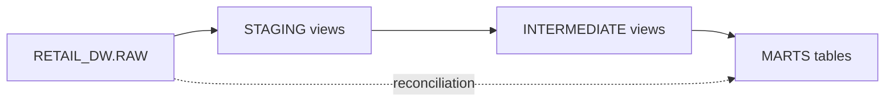

# Phase 7 — dbt Staging, Intermediate & Mart Models

> Transform Snowflake RAW Gold tables into analytics-ready dbt models with tests.

## Overview

Phase 7 implements the **dbt transformation layer** on top of Phase 6 Snowflake RAW loads:

- **Staging** — source-conformed views over 7 RAW dimension/fact tables
- **Intermediate** — business joins and daily/monthly aggregates
- **Marts** — 5 analytics marts mirroring Gold layer business metrics
- **Tests** — `unique`, `not_null`, `relationships`, and RAW reconciliation

## Architecture



## Project Layout

```
dbt/
├── dbt_project.yml
├── packages.yml
├── profiles/profiles.yml
├── macros/
│   ├── generate_schema_name.sql
│   └── business_rules.sql
├── models/
│   ├── staging/raw/          # 7 stg_raw__* models
│   ├── intermediate/         # 6 int_* models
│   └── marts/                # 5 mart_* models
└── tests/                    # Singular reconciliation tests
```

## Snowflake Schemas

| dbt layer | Snowflake schema | Materialization |
|-----------|------------------|-----------------|
| staging | `RETAIL_DW.STAGING` | view |
| intermediate | `RETAIL_DW.INTERMEDIATE` | view |
| marts | `RETAIL_DW.MARTS` | table |

## Model Inventory

### Staging (7 models)

| Model | Source | Grain |
|-------|--------|-------|
| `stg_raw__dim_date` | `RAW.DIM_DATE` | `date_key` |
| `stg_raw__dim_customers` | `RAW.DIM_CUSTOMERS` | `customer_key` |
| `stg_raw__dim_products` | `RAW.DIM_PRODUCTS` | `product_key` |
| `stg_raw__dim_country` | `RAW.DIM_COUNTRY` | `country_key` |
| `stg_raw__fct_orders` | `RAW.FCT_ORDERS` | `order_key` |
| `stg_raw__fct_order_items` | `RAW.FCT_ORDER_ITEMS` | `order_item_key` |
| `stg_raw__fct_payments` | `RAW.FCT_PAYMENTS` | `payment_key` |

### Intermediate (6 models)

| Model | Purpose |
|-------|---------|
| `int_orders_enriched` | Orders + customer segment/geography |
| `int_order_items_enriched` | Line items + order completion + product attrs |
| `int_orders_daily` | Daily order/revenue aggregates |
| `int_payments_daily` | Daily payment failure counts |
| `int_customer_first_order` | First order per customer |
| `int_customer_segment_orders` | Orders joined to segment attributes |

### Marts (5 models)

| Model | Grain | Key Metrics |
|-------|-------|-------------|
| `mart_daily_sales` | `sale_date` | Revenue, AOV, payment failure rate, cancellation rate |
| `mart_monthly_revenue` | `year_month` | MAC, new/returning customers, AOV |
| `mart_customer_lifetime_value` | `customer_key` | CLV, repeat purchase rate |
| `mart_product_performance` | `product_id` + category | Quantity sold, gross/net revenue |
| `mart_customer_segments` | segment + country | Revenue, repeat rate, cancellation rate |

## Business Rules

Configured as dbt `vars` in `dbt_project.yml` (from `config/gold_models.yaml`):

| Rule | Values |
|------|--------|
| Completed orders | `completed` |
| Cancelled orders | `cancelled` |
| Refunded orders | `refunded` |
| Successful payments | `succeeded` |
| Failed payments | `failed` |

Revenue logic is pre-computed in `RAW.FCT_ORDERS` (`gross_revenue`, `net_revenue` flags). dbt marts rebuild aggregates from staging/intermediate models.

## Quick Start

### Prerequisites

- Phase 6 Snowflake RAW tables loaded
- Snowflake credentials in `.env`
- `pip install -r requirements-dbt.txt`

### 1. Configure environment

```bash
cp .env.example .env
# Set SNOWFLAKE_* and DBT_PROFILES_DIR=./dbt/profiles
```

### 2. Create dbt schemas

```bash
python scripts/setup_dbt_schemas.py
```

### 3. Run dbt models

```bash
python scripts/run_dbt_models.py
```

### 4. Validate

```bash
python scripts/validate_dbt.py --compile-only   # no Snowflake needed
python scripts/validate_dbt.py                  # compile + test
pytest tests/unit/dbt/
```

### Run specific layers

```bash
python scripts/run_dbt_models.py --select staging+
python scripts/run_dbt_models.py --select marts
dbt test --select marts
```

## Tests

| Test type | Coverage |
|-----------|----------|
| Source `unique` / `not_null` | Primary keys on RAW dims/facts |
| Source `relationships` | FK: orders→customers, items→orders, payments→orders |
| Mart `unique` | `sale_date`, `year_month`, `customer_key` |
| `dbt_utils.unique_combination_of_columns` | Product and segment marts |
| Singular test | `assert_mart_daily_sales_matches_raw` reconciles dbt vs RAW |

## End-to-End Pipeline

```bash
# Phase 6 — Snowflake RAW load
python scripts/setup_snowflake.py
python scripts/run_snowflake_load.py

# Phase 7 — dbt models
python scripts/setup_dbt_schemas.py
python scripts/run_dbt_models.py
python scripts/validate_dbt.py
```

## Deployment Notes

- Use `DBT_TARGET=prod` for production runs
- Mart tables materialize as tables; consider incremental on date-keyed marts
- RAW marts remain available for reconciliation against dbt-built marts
- Add `dbt docs generate` and `dbt docs serve` for model documentation

## Next Phase

Phase 8 added **Apache Airflow** orchestration. See [phase8-airflow-orchestration.md](phase8-airflow-orchestration.md).
