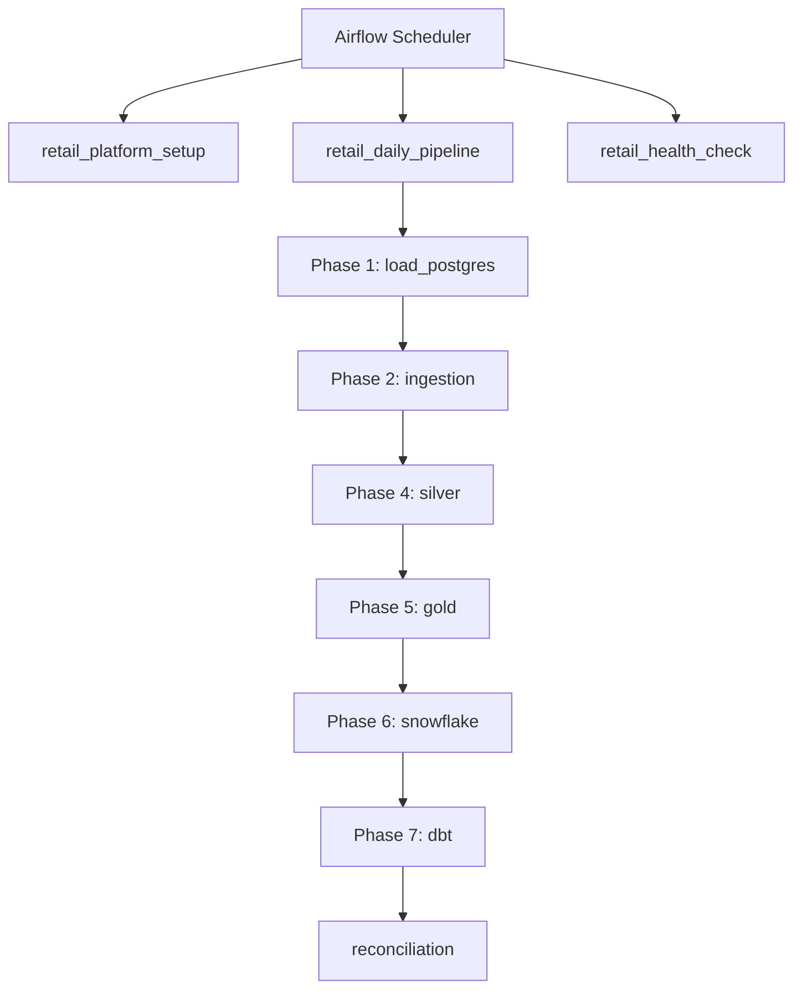

# Phase 8 — Airflow Orchestration

> Orchestrate the full retail lakehouse pipeline with Apache Airflow DAGs and reconciliation reporting.

## Overview

Phase 8 adds **Apache Airflow** to coordinate all pipeline scripts built in Phases 1–7:

- **Setup DAG** — one-time Snowflake and dbt schema provisioning
- **Daily pipeline DAG** — Postgres → Bronze → Silver → Gold → Snowflake → dbt
- **Health check DAG** — weekly dry-run and compile-only validation
- **Reconciliation** — cross-layer row count report

## Architecture



## Project Layout

```
airflow/
├── Dockerfile
├── dags/
│   ├── retail_platform_setup.py
│   ├── retail_daily_pipeline.py
│   └── retail_health_check.py
├── include/
│   └── task_commands.py
└── logs/                         # gitignored

src/retail_lakehouse/orchestration/
└── reconciliation.py

scripts/run_reconciliation.py
db/init/02_airflow_db.sql
requirements-airflow.txt
```

## DAG Details

### `retail_platform_setup` (manual)

| Task | Script |
|------|--------|
| `wait_for_postgres` | `pg_isready` health check |
| `setup_snowflake` | `scripts/setup_snowflake.py` |
| `setup_dbt_schemas` | `scripts/setup_dbt_schemas.py` |

### `retail_daily_pipeline` (02:00 UTC daily)

| Task Group | Tasks |
|------------|-------|
| `phase1_source` | `load_postgres --truncate` → `validate_phase1` |
| `phase2_bronze` | `generate_file_sources` → `run_local_ingestion` → `validate_phase2` |
| `phase4_silver` | `run_silver_transforms` → `validate_silver` |
| `phase5_gold` | `run_gold_models` → `validate_gold` |
| `phase6_snowflake` | `run_snowflake_load` → `validate_snowflake` |
| `phase7_dbt` | `run_dbt_models` → `validate_dbt` |
| `run_reconciliation` | `run_reconciliation.py` |

### `retail_health_check` (weekly)

- `run_snowflake_load --dry-run`
- `validate_dbt --compile-only`
- `run_reconciliation --skip-snowflake`

## Docker Compose

Airflow runs under the `airflow` compose profile:

```bash
docker compose --profile airflow up -d
```

| Service | Port | Role |
|---------|------|------|
| `postgres` | 55432 | OLTP + `airflow_db` metadata |
| `airflow-webserver` | 8080 | Airflow UI |
| `airflow-scheduler` | — | DAG execution |
| `airflow-init` | — | DB migrate + admin user (one-shot) |

## Quick Start

### 1. Configure environment

```bash
cp .env.example .env

# Generate and set Fernet key
python -c "from cryptography.fernet import Fernet; print(Fernet.generate_key().decode())"
```

### 2. Start Airflow

```bash
docker compose --profile airflow up -d
docker compose ps
```

Open **http://localhost:8080** (default: `admin` / `admin`).

### 3. Run setup DAG (once)

Unpause and trigger `retail_platform_setup` in the Airflow UI.

### 4. Run daily pipeline

Unpause `retail_daily_pipeline` or trigger manually.

### 5. Reconciliation (standalone)

```bash
python scripts/run_reconciliation.py
python scripts/run_reconciliation.py --skip-snowflake
```

Reports are written to `data/reconciliation/reconciliation_*.json`.

## Reconciliation

The reconciliation reporter compares:

| Layer | Source |
|-------|--------|
| PostgreSQL | Live table `COUNT(*)` per entity |
| Bronze | Parquet file sampling in landing zone |
| Silver / Gold / Snowflake | Latest pipeline manifest JSON |

Mismatches between Postgres and Bronze counts are flagged as issues.

## CI/CD

GitHub Actions workflow (`.github/workflows/ci.yml`):

- `pytest` for unit, dbt, Airflow, and orchestration tests
- `dbt compile` validation job

## Configuration

| Variable | Purpose |
|----------|---------|
| `AIRFLOW__CORE__FERNET_KEY` | Encrypt Airflow connections |
| `AIRFLOW__DATABASE__SQL_ALCHEMY_CONN` | Metadata DB (`airflow_db`) |
| `AIRFLOW_ADMIN_USERNAME` / `PASSWORD` | Web UI login |
| `RETAIL_PROJECT_ROOT` | Mounted repo path in containers |
| `SNOWFLAKE_*` | Passed through for Phase 6/7 tasks |

Inside Docker, `POSTGRES_HOST=postgres` and `POSTGRES_PORT=5432` override host-side defaults automatically via `task_commands.py`.

## Deployment Notes

- Custom Airflow image includes Java 17, PySpark, Snowflake connector, and dbt
- Spark tasks require adequate container memory (recommend 4GB+)
- Mount `.env` secrets via Docker Compose environment substitution
- Use `max_active_runs=1` on daily DAG to prevent overlapping runs
- Production: switch to CeleryExecutor/KubernetesExecutor and external secrets manager

## End-to-End (Orchestrated)

```bash
docker compose --profile airflow up -d
# Trigger retail_platform_setup (once)
# Trigger retail_daily_pipeline
```

## Platform Complete

With Phase 8, the platform delivers a full portfolio-grade pipeline:

**PostgreSQL → Bronze → Silver → Gold → Snowflake RAW → dbt MARTS** — orchestrated by Airflow with validation at every stage.
