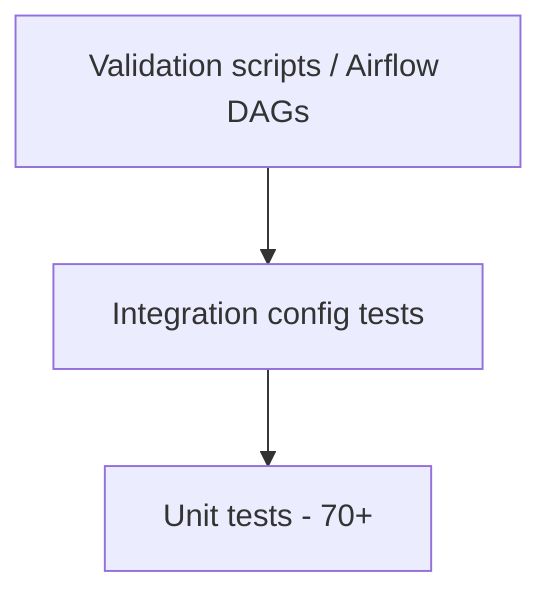

# Phase 9 — Testing, CI/CD & Documentation

> Production-grade quality gates, GitHub Actions CI, runbooks, and contributor documentation.

## Overview

Phase 9 hardens the platform with:

- **Expanded test suite** — CLI smoke tests, loader tests, config integration, DAG import
- **CI/CD pipeline** — lint, typecheck, Spark tests, coverage, dbt, Airflow jobs
- **Developer tooling** — Ruff, Mypy, pre-commit, Makefile, `run_ci_local.py`
- **Documentation** — CONTRIBUTING, LICENSE, runbooks, refreshed README/architecture

## Test Pyramid



| Layer | Location | Count | CI Job |
|-------|----------|-------|--------|
| Unit (non-Spark) | `tests/unit/` | ~55 | `test` |
| Unit (Spark) | `transforms/`, `gold/`, `warehouse/` | ~6 | `test-spark` |
| Integration | `tests/integration/` | 7 | `test` |
| dbt structure | `tests/unit/dbt/` | 5 | `dbt` |
| Airflow | `tests/unit/airflow/` | 4 | `airflow` |
| Script smoke | `tests/unit/scripts/` | 18 | `test` (AST `@click.command` validation) |

Spark tests are auto-marked via `tests/conftest.py`.

## CI/CD Pipeline

GitHub Actions workflow: `.github/workflows/ci.yml`

| Job | What it runs |
|-----|--------------|
| `lint` | `ruff check` + `ruff format --check` |
| `typecheck` | `mypy src/retail_lakehouse` |
| `test` | `pytest -m "not spark"` |
| `test-spark` | `pytest -m spark` with Java 17 |
| `coverage` | Full suite + `coverage.xml` artifact (60% gate) |
| `dbt` | `dbt deps`, `dbt compile`, dbt unit tests |
| `airflow` | Airflow DAG structure + import tests |

Dependabot updates pip and GitHub Actions weekly.

## Local Development

### Quick CI

```bash
pip install -r requirements-dev.txt
python scripts/run_ci_local.py
```

### Pre-commit

```bash
pip install pre-commit
pre-commit install
pre-commit run --all-files
```

### Coverage

```bash
pytest --cov=retail_lakehouse --cov-report=term-missing
```

Threshold: **60%** (`pyproject.toml` → `[tool.coverage.report] fail_under`)

## Configuration Files

| File | Purpose |
|------|---------|
| `pyproject.toml` | pytest, coverage, ruff, mypy |
| `requirements-dev.txt` | ruff, mypy, pre-commit |
| `.pre-commit-config.yaml` | Git hooks |
| `Makefile` | `make ci-local`, `make lint`, etc. |
| `.github/dependabot.yml` | Dependency updates |
| `.github/pull_request_template.md` | PR checklist |

## Runbooks

| Runbook | Topic |
|---------|-------|
| [local-development.md](runbooks/local-development.md) | Docker, Java, Snowflake setup |
| [pipeline-failures.md](runbooks/pipeline-failures.md) | Per-phase failure recovery |
| [airflow-operations.md](runbooks/airflow-operations.md) | DAG debugging |
| [reconciliation.md](runbooks/reconciliation.md) | Reconciliation report interpretation |

## Documentation Index

| Doc | Phase |
|-----|-------|
| [phase2-adf-ingestion.md](phase2-adf-ingestion.md) | Bronze ingestion |
| [phase4-silver-transforms.md](phase4-silver-transforms.md) | Silver DQ |
| [phase5-gold-models.md](phase5-gold-models.md) | Gold models |
| [phase6-snowflake-load.md](phase6-snowflake-load.md) | Snowflake RAW |
| [phase7-dbt-models.md](phase7-dbt-models.md) | dbt layers |
| [phase8-airflow-orchestration.md](phase8-airflow-orchestration.md) | Airflow DAGs |
| [phase9-testing-cicd-docs.md](phase9-testing-cicd-docs.md) | This document |
| [architecture.md](architecture.md) | Cross-phase architecture |

## Platform Complete

With Phase 9, the Retail Lakehouse Data Platform is a **portfolio-ready, production-style** project:

**PostgreSQL → Bronze → Silver → Gold → Snowflake → dbt** — tested, documented, and CI-gated.
